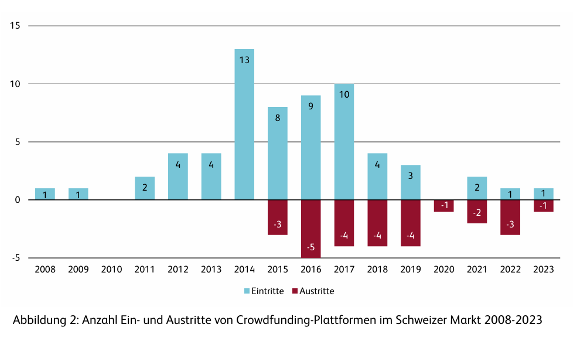
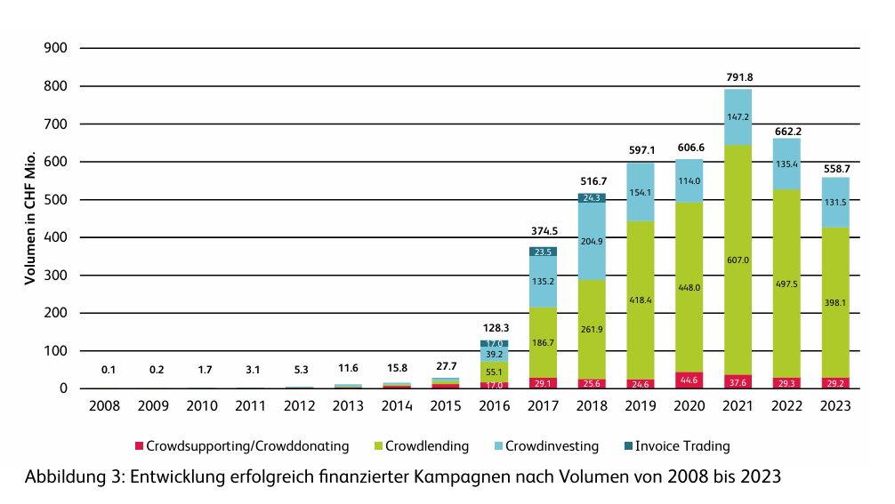

# FundHive
FundHive ist eine FinTeech-Plattform, die Startups mit interessierten Investoren verbindet. Investoren können sich über die Startups informieren und direkt investieren. Die exklusive KI der Plattform hilft sowohl Investoren als auch Unternehmern, das Investitionsrisiko und die Erfolgsaussichten besser einzuschätzen.

# Inhaltsverzeichnis
- [Einleitung](#einleitung)
    - [Explore-Board](#explore-board)
    - [Create-Board](#create-board)
    - [Evaluate-Board](#evaluate-board)
    - [Diskussion Feedback Pitch](#diskussion-feedback-pitch)
- [Anforderungen](#anforderungen)
    - [Use-Case Diagramm](#use-case-diagramm)
    - [Use-Case Beschreibung](#use-case-beschreibung)
    - [Fachliches Datenmodell](#fachliches-datenmodell)
    - [Erläuterungen zum Datenmodell](#erläuterungen-zum-datenmodell)
    - [Zustandsdiagramm](#zustandsdiagramm)
    - [UI-Mockup](#ui-mockup)
- [Implementation](#implementation)
    - [Frontend](#frontend)
    - [KI-Funktionen](#ki-funktionen)
- [Fazit](#fazit)
    - [Stand der Implementation](#stand-der-implementation)
    
# Einleitung

## Explore-Board
### TRENDS & TECHNOLOGIE
> Durch die zunehmende Digitalisierung und den erleichterten Zugang zu Know-how hat sich in der Schweiz in den letzten 15 Jahren ein wachsender Markt für Crowdfunding entwickelt. Wie in der folgenden Abbildung ersichtlich, gab es in den letzten zehn Jahren einen Boom an Crowdfunding-Plattformen. Dieser Boom hat sich jedoch mittlerweile abgeschwächt und die Gesamtanzahl der Plattformen ist seit 2020 weitgehend stabil geblieben.

> Besonders relevant für FundHive ist die Entwicklung des Volumens im Bereich des Crowdinvestings. Diese Branche ist noch relativ jung und hat sich seit 2017 bei einem durchschnittlichen Volumen von rund 150 Millionen Franken stabilisiert.

> FundHive sieht in der fortschreitenden Entwicklung von prädiktiven Modellen die Chance, sich in diesen Markt zu integrieren. Die stetig verbesserten Datenmodelle und das wachsende Volumen an Datensätzen ermöglichen es, eine Vielzahl von Branchen zu innovieren und diese werden Kapital benötigen.

### POTENTIELLE PARTNER & WETTBEWERB
> Grösste Wettbewerber im der Crowdfunding Branche: Conda, OOMNIUM 

> Als mögliche Partner könnten Crowdhouse (gegründet 2015) und Foxstone(2017) unsere Plattform unterstützen da sie den Grossteil des Volumens in Crowdfunding einnehmen jedoch beträgt die Mindestinvestitionssummen in der Regel mehrere zehntausend Franken. Daher besteht die Möglichkeit das FundHive das finanzieren attraktiver macht für weniger Kapitaleinsatz.

### FAKTEN
> Viele der Abbildungen und Informationen zum Markt und zur Branche wurden aus der jährlichen Crowdfunding Studie des Instituts für Finanzdienstleistungen Zug IFZ der Hochschule Luzern. Das Dokument ist im Ordner /doc beireitgestellt.

### POTENZIALFELDER
> Demokratisierung der Startup-Investitionen:
Der aktuelle Crowdinvesting-Markt in der Schweiz ist geprägt von hohen Mindestinvestitionen, die oft mehrere zehntausend Franken betragen. Dies stellt eine Hürde für Kleinanleger dar, die sich an vielversprechenden Startups beteiligen möchten. FundHive könnte hier eine Lücke schließen, indem es eine zugänglichere Investmentlösung mit geringeren Einstiegshürden anbietet.

> Transparenz und Glaubwürdigkeit im Startup-Finanzierungsmarkt:
Ein wiederkehrendes Thema im Bereich Startup-Finanzierung ist das fehlende Vertrauen zwischen Investoren und Startups. Viele Investoren haben Schwierigkeiten, die Qualität und Seriosität eines Startups objektiv einzuschätzen. Durch KI-gestützte Due-Diligence-Prozesse und ein Bewertungssystem für Startups und Investoren könnte FundHive das Vertrauen erhöhen und so den Markt effizienter gestalten.

> Wachsendes Volumen an Startup-Daten für prädiktive Modelle:
Die zunehmende Digitalisierung ermöglicht es, große Mengen an Daten über Startups, Finanzierungsrunden und Markttrends zu sammeln. Die Nutzung von KI- und Datenanalysen zur Vorhersage von Investmentchancen wird in der Finanzbranche immer relevanter. FundHive könnte sich als führende Plattform für datengetriebenes Investieren positionieren und Investoren eine analytisch fundierte Entscheidungsbasis bieten.

> Integration neuer Finanzierungsmodelle:
Neben klassischen Crowdinvesting-Methoden entstehen neue Modelle wie Revenue-Based Financing oder tokenisierte Investments (z. B. über Blockchain). FundHive könnte langfristig solche Modelle integrieren, um eine flexible und innovative Finanzierungsplattform für Startups und Investoren zu bieten.

### USER
> FundHive richtet sich an Startups auf der Suche nach Finanzierung und Investoren, die nach innovativen Investmentmöglichkeiten suchen. Startups benötigen Zugang zu Kapital und vertrauenswürdigen Geldgebern, während Investoren Wert auf transparente Bewertungen und effiziente Entscheidungsprozesse legen.

### BEDÜRFNISSE
> Startups brauchen eine einfache Möglichkeit, Investoren zu finden, eine stärkere Glaubwürdigkeit und eine schnellere Kapitalbeschaffung.

> Investoren verlangen verlässliche Bewertungen, geringere Einstiegshürden und effizientere Due-Diligence-Prozesse.

### ERKENNTNISSE
> - Investoren benötigen transparente Bewertungsmechanismen, um fundierte Entscheidungen zu treffen.
> - FundHive soll wie LinkedIn für Venture Capital funktionieren.
> - Startups haben Schwierigkeiten, geeignete Investoren zu finden und Vertrauen aufzubauen.
> - Startups müssen aktiv Investoren überzeugen.

### TOUCHPOINTS
> - Plattform & Mobile-App
> - Netzwerk-Events & Online-Pitches
> - LinkedIn & Finanzportale
> - Partnerschaften mit Inkubatoren
> - E-Mail & Push-Benachrichtigungen

### WIE KÖNNEN WIR?
> Wie können wir Investoren den Zugang zu glaubwürdigen Startups erleichtern und Startups helfen, vertrauenswürdige Investoren effizienter zu finden?

## Create-Board
### IDEEN-BESCHREIBUNG
> Im Feld Ideenbeschreibung notieren wir den Kern unserer Idee. Sie sollte sich auf einen klaren Anwendungsfall fokussieren und diesen beschreiben.

### ADRESSIERTE NUTZER
> Im Feld Adressierte NutzerInnen schreiben wir Details und Besonderheiten zu den NutzerInnen auf, für die wir unsere Lösungsidee entwickeln.

### ADRESSIERTE BEDÜRFNISSE
> In Feld Bedürfnisse notieren wir die Bedürfnisse der NutzerInnen, die wir mit unserer Idee erfüllen wollen.

### PROBLEME
> Im Feld Probleme notieren wir die ein bis drei drängendsten Probleme, die mit diesen Bedürfnissen zu tun haben.

### IDEENPOTENZIAL
Mehrwert: Mückenstich vs. Hai-Attacke

🔵🔵🔵⚪️⚪️⚪️⚪️⚪️⚪️⚪️

Übertragbarkeit: Robinson Crusoe vs. die Welt

🔵🔵🔵🔵🔵⚪️⚪️⚪️⚪️⚪️

Machbarkeit: Hammer vs. Raumschiff

🔵🔵🔵🔵🔵🔵🔵🔵⚪️⚪️

### DAS WOW
> Im Feld Das Wow notieren wir das eine Detail unserer Lösungsidee, für das wir in der Presse gefeiert werden wollen.

### HIGH-LEVEL-KONZEPT
> Im Feld High-Level-Konzept notieren wir eine griffige Analogie, mit der wir unsere Lösungsidee beschreiben könnten.

### WERTVERSPRECHEN
> Ins Feld Wertversprechen schreiben wir unsere Lösungshypothese. Sie ist die Synthese aus Idee, NutzerIn, Bedürfnis und Ideenpotenzial. Und sie ist unsere Antwort auf die Wie-können-wir-Frage aus den EXPLORE-BOARD.

## Evaluate-Board
### KANÄLE
> Beschreibe die Vertriebs- und Marketingkanäle, über welche die NutzerInnen erreicht werden sollen. Beispiel: TikTok, E-Mail, Flyer etc.

### UNFAIRER VORTEIL
> Notiere Faktoren der Lösung, die nur schwer oder gar nicht kopierbar sind. Diese Faktoren machen es schwierig, ein Konkurrenzprodukt deiner Lösung zu lancieren. 

### KPI
Anzahl Startups, Anzahl Investoren

> Trage hier Messgrössen ein, mit denen sich der Erfolg deiner Lösung messen lässt. Beispiele: Anzahl Verkäufe, Anzahl Kunden, Anzahl Transaktionen, Umsatz...

### EINNAHMEQUELLEN
> Beschreibe, wie mit deiner Lösung Geld verdient werden soll. Wo und durch wen werden Einnahmen generiert? Hinweis: die Einnahmen müssen nicht unbedingt von den NutzerInnen stammen. Es kann auch eine Trägerschaft wie z.B. ein Verein mit Mitgliederbeiträgen, Spenden oder ähnlichem gewählt werden.

## Diskussion Feedback Pitch
> Diskussion des Feedbacks aus dem Pitch (bezogen auf Projektinhalt)

# Anforderungen
## Use-Case Diagramm
> Hier das Diagramm einbinden

## Use-Case Beschreibung

> Hier die Use-Case Beschreibung einfügen so wie du das in RE gelernt hast. 

## Fachliches Datenmodell 

## Erläuterungen zum Datenmodell 
> Beschreibe die Entitäten, deren Attribute sowie die Beziehungen zwischen den Entitäten.

## Zustandsdiagramm
> Hier das Zustandsdiagramm einbinden für diejenige Entität(en), welche mehrere Zustände durchläuft mit Events, Effects und Guards.

## UI-Mockup 
> Mockup oder Skizze des UIs

# Implementation
## Frontend
> Beschreibung des Frontends mit Screenshots der fertigen Applikation. Alle Teile des GUIs, die bewertet werden sollen, müssen abgebildet sein.

## KI-Funktionen
> Aufgaben und Funktionen des eingebundenen KI-Modells.

# Fazit

## Stand der Implementation
> Stand der Implementation, nächste Schritte (mit Referenz auf den Backlog).
