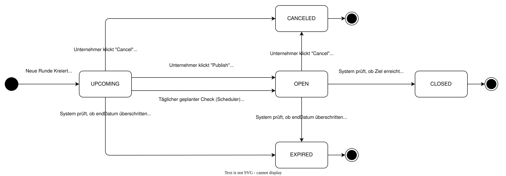

# FundHive
FundHive ist eine FinTeech-Plattform, die Startups mit interessierten Investoren verbindet. Investoren können sich über die Startups informieren und direkt investieren. Die exklusive KI der Plattform hilft sowohl Investoren als auch Unternehmern, das Investitionsrisiko und die Erfolgsaussichten besser einzuschätzen.

# Inhaltsverzeichnis
- [Einleitung](#einleitung)
    - [Explore-Board](#explore-board)
    - [Create-Board](#create-board)
    - [Evaluate-Board](#evaluate-board)
    - [Diskussion Feedback Pitch](#diskussion-feedback-pitch)
- [Anforderungen](#anforderungen)
    - [Use-Case Diagramm](#use-case-diagramm)
    - [Use-Case Beschreibung](#use-case-beschreibung)
    - [Fachliches Datenmodell](#fachliches-datenmodell)
    - [Erläuterungen zum Datenmodell](#erläuterungen-zum-datenmodell)
    - [Zustandsdiagramm](#zustandsdiagramm)
    - [UI-Mockup](#ui-mockup)
- [Implementation](#implementation)
    - [Frontend](#frontend)
    - [KI-Funktionen](#ki-funktionen)
- [Fazit](#fazit)
    - [Stand der Implementation](#stand-der-implementation)
    
# Einleitung

## Explore-Board
### TRENDS & TECHNOLOGIE
Durch die zunehmende Digitalisierung und den erleichterten Zugang zu Know-how hat sich in der Schweiz in den letzten 15 Jahren ein wachsender Markt für Crowdfunding entwickelt. Wie in der folgenden Abbildung ersichtlich, gab es in den letzten zehn Jahren einen Boom an Crowdfunding-Plattformen. Dieser Boom hat sich jedoch mittlerweile abgeschwächt und die Gesamtanzahl der Plattformen ist seit 2020 weitgehend stabil geblieben.

Besonders relevant für FundHive ist die Entwicklung des Volumens im Bereich des Crowdinvestings. Diese Branche ist noch relativ jung und hat sich seit 2017 bei einem durchschnittlichen Volumen von rund 150 Millionen Franken stabilisiert.

FundHive sieht in der fortschreitenden Entwicklung von prädiktiven Modellen die Chance, sich in diesen Markt zu integrieren. Die stetig verbesserten Datenmodelle und das wachsende Volumen an Datensätzen ermöglichen es, eine Vielzahl von Branchen zu innovieren und diese werden Kapital benötigen.

### POTENTIELLE PARTNER & WETTBEWERB
Grösste Wettbewerber im der Crowdfunding Branche: Conda, OOMNIUM 

Als mögliche Partner könnten Crowdhouse (gegründet 2015) und Foxstone(2017) unsere Plattform unterstützen da sie den Grossteil des Volumens in Crowdfunding einnehmen jedoch beträgt die Mindestinvestitionssummen in der Regel mehrere zehntausend Franken. Daher besteht die Möglichkeit das FundHive das finanzieren attraktiver macht für weniger Kapitaleinsatz.

### FAKTEN
Viele der Abbildungen und Informationen zum Markt und zur Branche wurden aus der jährlichen Crowdfunding Studie des Instituts für Finanzdienstleistungen Zug IFZ der Hochschule Luzern. Das Dokument ist im Ordner /doc beireitgestellt.

### POTENZIALFELDER
Demokratisierung der Startup-Investitionen:
Der aktuelle Crowdinvesting-Markt in der Schweiz ist geprägt von hohen Mindestinvestitionen, die oft mehrere zehntausend Franken betragen. Dies stellt eine Hürde für Kleinanleger dar, die sich an vielversprechenden Startups beteiligen möchten. FundHive könnte hier eine Lücke schließen, indem es eine zugänglichere Investmentlösung mit geringeren Einstiegshürden anbietet.

Transparenz und Glaubwürdigkeit im Startup-Finanzierungsmarkt:
Ein wiederkehrendes Thema im Bereich Startup-Finanzierung ist das fehlende Vertrauen zwischen Investoren und Startups. Viele Investoren haben Schwierigkeiten, die Qualität und Seriosität eines Startups objektiv einzuschätzen. Durch KI-gestützte Due-Diligence-Prozesse und ein Bewertungssystem für Startups und Investoren könnte FundHive das Vertrauen erhöhen und so den Markt effizienter gestalten.

Wachsendes Volumen an Startup-Daten für prädiktive Modelle:
Die zunehmende Digitalisierung ermöglicht es, große Mengen an Daten über Startups, Finanzierungsrunden und Markttrends zu sammeln. Die Nutzung von KI- und Datenanalysen zur Vorhersage von Investmentchancen wird in der Finanzbranche immer relevanter. FundHive könnte sich als führende Plattform für datengetriebenes Investieren positionieren und Investoren eine analytisch fundierte Entscheidungsbasis bieten.

Integration neuer Finanzierungsmodelle:
Neben klassischen Crowdinvesting-Methoden entstehen neue Modelle wie Revenue-Based Financing oder tokenisierte Investments (z. B. über Blockchain). FundHive könnte langfristig solche Modelle integrieren, um eine flexible und innovative Finanzierungsplattform für Startups und Investoren zu bieten.

### USER
FundHive richtet sich an Startups auf der Suche nach Finanzierung und Investoren, die nach innovativen Investmentmöglichkeiten suchen. Startups benötigen Zugang zu Kapital und vertrauenswürdigen Geldgebern, während Investoren Wert auf transparente Bewertungen und effiziente Entscheidungsprozesse legen.

### BEDÜRFNISSE
Startups brauchen eine einfache Möglichkeit, Investoren zu finden, eine stärkere Glaubwürdigkeit und eine schnellere Kapitalbeschaffung.

Investoren verlangen verlässliche Bewertungen, geringere Einstiegshürden und effizientere Due-Diligence-Prozesse.

### ERKENNTNISSE
 - Investoren benötigen transparente Bewertungsmechanismen, um fundierte Entscheidungen zu treffen.
 - FundHive soll wie LinkedIn für Venture Capital funktionieren.
 - Startups haben Schwierigkeiten, geeignete Investoren zu finden und Vertrauen aufzubauen.
 - Startups müssen aktiv Investoren überzeugen.

### TOUCHPOINTS
 - Plattform & Mobile-App
 - Netzwerk-Events & Online-Pitches
 - LinkedIn & Finanzportale
 - Partnerschaften mit Inkubatoren
 - E-Mail & Push-Benachrichtigungen

### WIE KÖNNEN WIR?
Wie können wir Investoren den Zugang zu glaubwürdigen Startups erleichtern und Startups helfen, vertrauenswürdige Investoren effizienter zu finden?

## Create-Board
### IDEEN-BESCHREIBUNG
FundHive ist eine Plattform, die Investoren mit verlässlichen Daten unterstützt und Startups eine glaubwürdige Präsentation ermöglicht. Durch KI-gestützte Analysen vereinfachen wir Investitionsentscheidungen und reduzieren den Aufwand für komplexe Bewertungen.

Anwendungsfall: Ein Startup stellt sich auf FundHive mit einer KI-gestützten Unternehmensbewertung vor. Investoren sehen nicht nur Finanzkennzahlen, sondern auch automatisierte Risikoanalysen und Zusammenhänge, die durch Algorithmen erkannt wurden. Dadurch können sie fundierte Investmententscheidungen treffen, ohne selbst tief in Finanzmodelle einsteigen zu müssen.

### ADRESSIERTE NUTZER
Startups (Kapitalnehmende):
 - Frühphasen-Startups (Seed bis Series A), die Kapital für Wachstum benötigen.
 - Junge Unternehmen mit innovativen Geschäftsmodellen, die sich abseits klassischer VC-Finanzierungen bewegen.

Investoren (Kapitalgebende):
 - Angel-Investoren & Business Angels → Erfahrene Einzelpersonen, die in junge Startups investieren und oft auch Mentoring bieten.
 - VC-Fonds → Professionelle Investoren, die in Startups mit erstem Markterfolg investieren, um schnelles Wachstum zu fördern.

### ADRESSIERTE BEDÜRFNISSE
Startups:
 - Zugang zu passenden Investoren, die über das nötige Kapital und Branchenwissen verfügen.
 - Glaubwürdige Präsentation der eigenen Finanz- und Geschäftsdaten, um das Vertrauen von Investoren zu gewinnen.
 - Vereinfachung des Investment-Prozesses, um weniger Zeit für Investorensuche und Due-Diligence-Verfahren aufwenden zu müssen.

Investoren:
 - Zugriff auf strukturierte, verständliche und KI-gestützte Bewertungen, um Startups effizient einschätzen zu können.
 - Reduzierung des eigenen Rechercheaufwands durch vorbereitete Finanzkennzahlen und Risikoanalysen.
 - Erhöhte Sicherheit durch datenbasierte Startup-Bewertungen, um fundierte Investmententscheidungen zu treffen.

### PROBLEME
Startups:
 - Schwierigkeiten, relevante Investoren zu finden, die zu ihrem Geschäftsmodell passen.
 - Fehlende Mittel oder Kenntnisse, um Finanz- und Unternehmensdaten verständlich aufzubereiten.
 - Der Finanzierungsprozess ist aufwändig, langwierig und erfordert viel manuelle Arbeit.

Investoren:
 - Fehlende Transparenz über die Qualität und das Potenzial eines Startups.
 - Hoher Zeitaufwand für die individuelle Due-Diligence und Bewertung von Startups.
 - Fehlende strukturierte Plattform, um Investments effizient zu vergleichen und Entscheidungen schneller zu treffen.

### IDEENPOTENZIAL
Mehrwert: Mückenstich vs. Hai-Attacke

🔵🔵🔵⚪️⚪️⚪️⚪️⚪️⚪️⚪️

Übertragbarkeit: Robinson Crusoe vs. die Welt

🔵🔵🔵🔵⚪️⚪️⚪️⚪️⚪️⚪️

Machbarkeit: Hammer vs. Raumschiff

🔵🔵🔵🔵🔵🔵🔵🔵⚪️⚪️

### DAS WOW
„Die erste Plattform, die Startup-Investments mit KI-gestützten Bewertungen revolutioniert – Investoren erhalten datenbasierte Einblicke, die sonst nur Großbanken vorbehalten sind.“

### HIGH-LEVEL-KONZEPT
„Das Bloomberg-Terminal für Startup-Investments – einfach, transparent und datengetrieben.“
„Startup-Investing neu gedacht – datengetrieben, intuitiv und transparent.“

### WERTVERSPRECHEN
FundHive verbindet Startups und Investoren durch datenbasierte, transparente Analysen. Unsere KI-gestützte Plattform reduziert den Due-Diligence-Aufwand und schafft Vertrauen durch objektive Bewertungen – für effizientere, schnellere und fundierte Investmententscheidungen.

## Evaluate-Board
### KANÄLE
- **Digital:** LinkedIn, Twitter/X, Google Ads, Finanzportale  
- **Offline:** Startup- & Investoren-Events, Kooperationen mit Inkubatoren  
- **Direkt:** E-Mail-Marketing, Referral-Programme  

### UNFAIRER VORTEIL
- **KI-gestützte Due-Diligence** für automatisierte Startup-Bewertungen  
- **KI-gestützte Unterstützung** für Selbstdarstellung der Starups
- **Exklusive Datenbank** mit validierten Startups & Investoren  
- **Niedrige Einstiegshürden** im Vergleich zu klassischen VC-Investments  

### KPI
- Anzahl **registrierter Startups & Investoren**  
- Anzahl **erfolgreicher Investments**  
- **Zeit bis zur Finanzierung** reduzieren  

### EINNAHMEQUELLEN
- **Erfolgsgebühr** auf abgeschlossene Investments  
- **Premium-Modelle** für erweiterte Analysefunktionen  

## Diskussion Feedback Pitch
| **Thema**                         | **Antwort / Maßnahme** |
|----------------------------------|--------------------------|
| **Vertrauen & Sicherheit**       | Startups durchlaufen eine **Verifizierungsphase**, z. B. Upload von Handelsregisterauszug, Website, Pitch Deck. Zusätzlich führen wir ein **KI-gestütztes Scoring-Modell** ein, das kontinuierlich neue Daten (Aktualität, Plausibilität) berücksichtigt. Scam-Versuche können durch Flagging durch andere Nutzer gemeldet werden. |
| **Datenherkunft & Qualität**     | Alle Analyse-Daten stammen direkt von den Startups, werden aber mit öffentlichen Quellen (z. B. Handelsregister, LinkedIn, Firmenverzeichnissen) abgeglichen. Eine **manuelle Stichprobenkontrolle** ist bei verdächtigen Fällen vorgesehen. |
| **KI-Funktion & Bias-Vermeidung**| Die KI dient nicht der Entscheidung, sondern der **Unterstützung**: Sie analysiert Trends, Risiken und Auffälligkeiten und zeigt diese transparent an. Investoren können dann eigenständig entscheiden. Wir planen zudem eine Möglichkeit zur **Erklärung von Scoring-Ergebnissen** („Why this score?“). |
| **Mehrwert gegenüber Konkurrenz**| Im Gegensatz zu Kickstarter & Co liegt der Fokus auf **echten Beteiligungen** und **datengesteuertem Matching**. FundHive ist **kein Spendenportal**, sondern eine Plattform für Kapitalbeteiligungen mit Fokus auf professionelle und zukünfige Investoren. |
| **Provision & Geschäftsmodell**  | Die **5–10 % Erfolgsprovision** liegt im Branchenschnitt. Weitere Einnahmen sind durch **Premium-Zugänge**  und **analytische Zusatzfunktionen** geplant. |
| **Geldfluss & Transaktionen**    | FundHive agiert als **Vermittlungsplattform** – die eigentliche Zahlungsabwicklung erfolgt über einen **verifizierten Drittanbieter**. So wird sichergestellt, dass das Geld erst nach Vertragsschluss weitergeleitet wird. |

# Anforderungen
## Use-Case Diagramm

## Use-Case Beschreibung
Use-Cases sind in alphabetisher Reihenfolge aufgelistet.

 **-- Finanzierungsrunde erfassen --**

- **Actors**: Entrepreneur  
- **Eintrittsbedingungen**: Das zugehörige Startup existiert bereits.  
- **Ereignissequenz**:  
  1. Entrepreneur navigiert zu seinem Startup-Page.  
  2. Öffnet das Formular mit dem Button „+ Create New Funding Round“.  
  3. Gibt relevante Informationen ein (z. B. Rundenname, Zielbetrag, Startdatum).  
  4. Speichert die Finanzierungsrunde.  
- **Austrittsbedingung**: Die Finanzierungsrunde wurde erfolgreich kreiert und erscheint mit Status `UPCOMING`unter Investment Rounds.  
- **Besondere Anforderungen**: Das Enddatum jeder Runde wird automatisch auf 90 Tage nach dem Startdatum gesetzt, daher ist es im interesse des Startups die Runde sobald wie möglich zu eröffnen.
- **Daten**: `round_name`, `goal_amount`, `start_date`

## Fachliches Datenmodell 

## Erläuterungen zum Datenmodell 

**Entitäten und Attribute**

| **Entität**         | **Attribute**                                                                                                   | **Attribut-Beschreibung**                                                                                                                                                           |
|---------------------|------------------------------------------------------------------------------------------------------------------|----------------------------------------------------------------------------------------------------------------------------------------------------------------------------------------|
| **Entrepreneur**     | `name`, `email`                                                                                                 | Der Name und die E-Mail-Adresse des Entrepreneurs, die zur Identifikation und Kontaktaufnahme dienen.                                                                                 |
| **Startup**          | `name`, `description`, `AI_rating`, `industry`, `funding_status`, `valuation`, `amount_raised`, `goal_amount` | Der Name des Startups, eine Beschreibung seines Geschäftsmodells, die durch KI vergebene Bewertung, die Branche, der aktuelle Finanzierungsstatus, die Bewertung des Unternehmens, der bereits eingesammelte Betrag und das Finanzierungsziel. |
| **Investment round** | `round_name`, `start_date`, `end_date`                                                                         | Bezeichnung der Finanzierungsrunde (z. B. Seed, Series A) sowie deren Start- und Enddatum.                                                                                            |
| **Investor**         | `name`, `email`, `AI_rating`                                                                                    | Der Name und die E-Mail-Adresse des Investors sowie eine durch KI vergebene Bewertung seiner Investitionshistorie oder Vertrauenswürdigkeit.                                         |
| **Transaction**      | `amount`, `date`                                                                                                | Die Höhe des investierten Betrags und das Datum, an dem die Transaktion durchgeführt wurde.                                                                                           |

**Beziehungen**
| **Beziehung** | **Beteiligte Entitäten**              | **Kardinalität**                            | **Beschreibung**                                                                 |
|---------------|----------------------------------------|---------------------------------------------|----------------------------------------------------------------------------------|
| `creates`     | Entrepreneur → Startup                 | 1 Entrepreneur erstellt N Startups          | Ein Entrepreneur kann mehrere Startups gründen, aber jedes Startup hat nur einen Gründer. |
| `launches`    | Startup → Investment round             | 1 Startup startet N Runden                  | Ein Startup kann mehrere Finanzierungsrunden durchführen.                        |
| `has`         | Investment round → Transaction         | 1 Runde → N Transaktionen                   | Eine Finanzierungsrunde umfasst viele Transaktionen.                             |
| `does`        | Investor → Transaction                 | 1 Investor tätigt N Transaktionen           | Ein Investor kann mehrfach investieren. Jede Transaktion gehört zu einem Investor. |
## Zustandsdiagramm
**Status der Finanzierungsrunden**

## UI-Mockup 
> Mockup oder Skizze des UIs

# Implementation
## Frontend
> Beschreibung des Frontends mit Screenshots der fertigen Applikation. Alle Teile des GUIs, die bewertet werden sollen, müssen abgebildet sein.

## KI-Funktionen

| **Anwendung** | **Aufgaben & Funktionen** |
|---------------|----------------------------------------|
| **Startup-Bewertung (AI Rating)** | Das System analysiert auf Basis von Name, Branche, Bewertung und Beschreibung eines Startups dessen Erfolgspotenzial. Eine Large Language Model (LLM)-basierte Bewertung liefert einen numerischen Score (0.0–5.0), der regelmäßig aktualisiert und beim Erstellen automatisch generiert wird. **Ziel:** Orientierungshilfe für Investoren und einheitliche Qualitätsindikatoren. |
| **Pitch-Optimierung (Beschreibung verbessern)** | Die KI überarbeitet die vorhandene Startup-Beschreibung im HTML-Format sprachlich und stilistisch, ohne neue Informationen hinzuzufügen. Dabei achtet das Modell auf professionelle, überzeugende Formulierungen und gute Struktur. **Ergebnis:** Eine ansprechende und investorentaugliche Präsentation des Startups – semantisch korrektes HTML inklusive. |
| **Investorensuche / Empfehlung (Startup-Matching)** | Ein dialogbasierter KI-Assistent versteht die Anfrage eines Investors (z. B. branchenspezifische Interessen oder Bewertungskriterien) und schlägt passende Startups aus der Datenbank vor. Die Entscheidung basiert auf Startupdaten, semantischem Verständnis und optional auch Tool-gestütztem Filtern (z. B. Branchen, Fundingstatus, Bewertungsspanne). **Ziel:** Relevante, präzise Empfehlungen in natürlicher Sprache. |

# Fazit

## Stand der Implementation
> Stand der Implementation, nächste Schritte (mit Referenz auf den Backlog).
